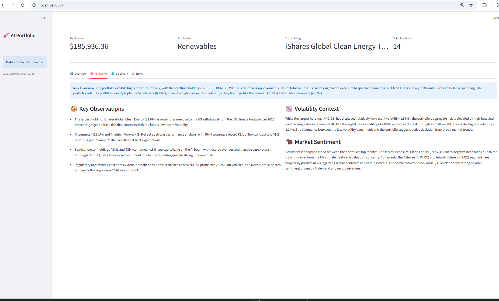
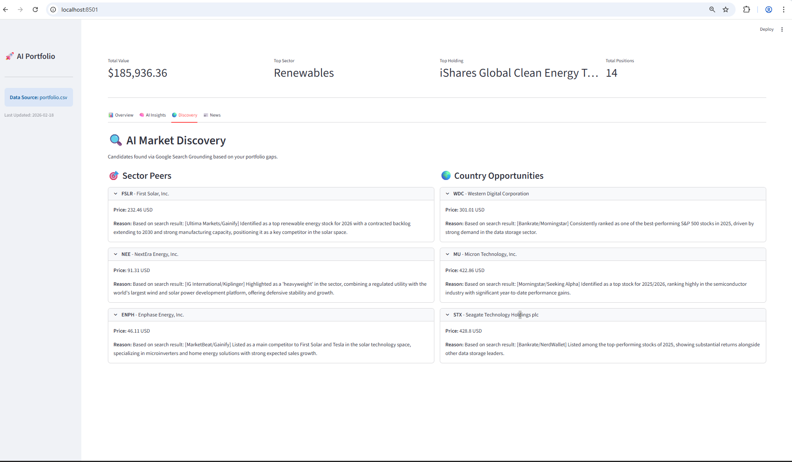
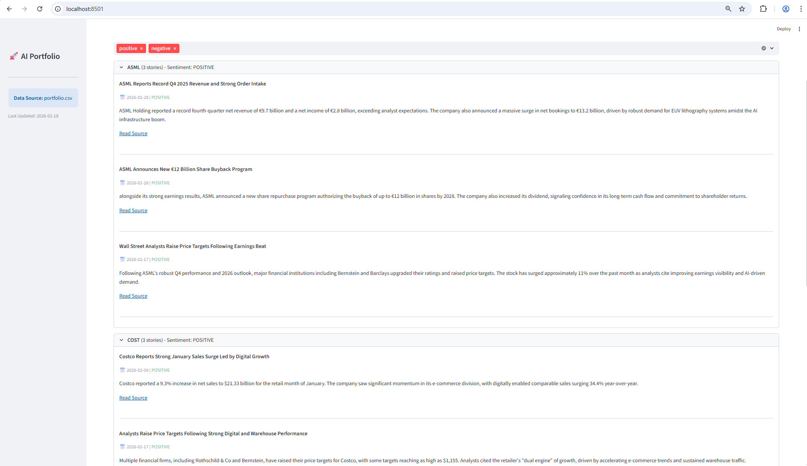
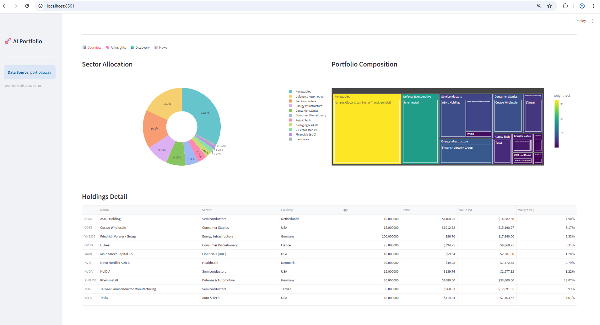

# AI Portfolio Analyzer & Discovery Tool
This project is an AI-powered financial dashboard. It takes a simple CSV of your stock holdings, fetches real-time market data, calculates risk metrics, searches for relevant news, and uses Google's Gemini (Nexus) to discover new investment opportunities.

# Code structure 
Configuration
`sc/config/settings.py` It manages file paths and loads your API keys.
`sc/env/secrets.env` Stores your sensitive API keys (Gitignored).
Source Code (/src/)
`data_fetch.py`
Role: Data Collection.
Action: Reads your CSV, connects to Yahoo Finance, and downloads price history for every ticker. Handles ticker mapping (e.g., converting .DE to .L if needed).

`feature_engineering.py`
Role: Extracts features
Action: Takes raw prices and calculates math-heavy metrics: 
- Portfolio Volatility, 
- Beta, 
- Sector Weights
- Correlation Matrices.

`news_pipeline.py`
Role: Get news articles from web to get the sentiment
Action: Uses Google Search (via GenAI) to find the top 3 recent stories for your stocks and determines if the sentiment is Positive, Negative, or Neutral.

`portfolio_analysis.py`
Role: The Sco
Action: Analyzes your portfolio gaps. It asks the AI: "Find me competitors to my current holdings" and "Find top stocks in my dominant country." It validates these new ideas with real market data.

`insight_generator.py`
Role: The Analyst.
Action: Feeds all the data (metrics + news) into the LLM to write a textual summary of your portfolio's risks and opportunities.

`app.py`
Role: Display.
Action: A Streamlit dashboard that visualizes your holdings, charts, AI discoveries, and news in a web browser.

Screenshots 
1.*Portfolio Analysis*

2.*AI Market Discovery* 

3.*News Story Feed*

4. *Simple Overview*

